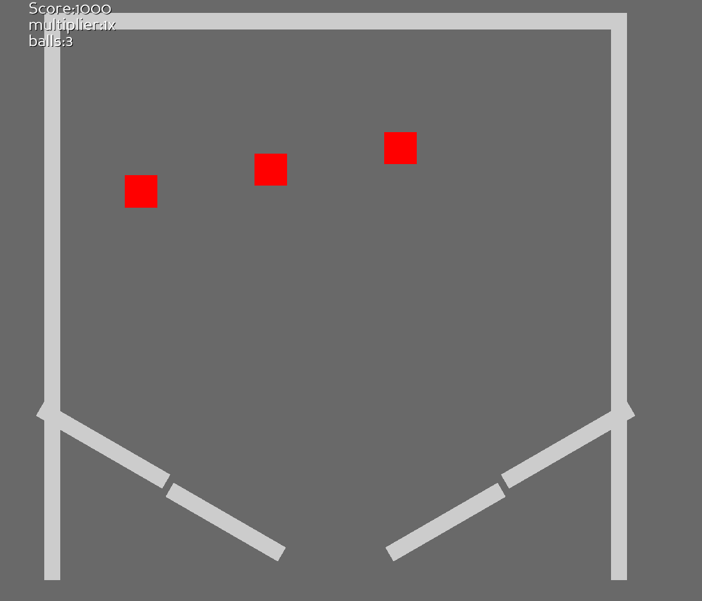

# panda3d pinball

play it in your browser over here: https://bmaxv.itch.io/panda-pinball

this is a pinball game I made to show case collisions and my collision module.

It depends on 2 of my own packages unfortunately.

Get them over here:

https://github.com/BMaxV/vector
https://github.com/BMaxV/panda3d_collisions

They should be trivial to install and not conflict with anything.

The setup is a bit annoying if you're doing it yourself and you want to make a new table. The normals of the "line" boundaries have to be adjusted manually to make the normals point into the right direction.

